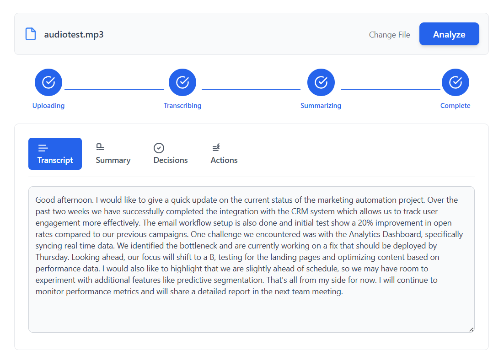

# 📝 AI Meeting Summarizer - Full Stack

A full-stack application to **transcribe meeting audio files** using [AssemblyAI](https://www.assemblyai.com/) and generate **structured summaries** via the Gemini API.

---

## 🚀 Features

- **Upload audio files** (mp3, wav, m4a, etc.)
- **Automatic transcription** via AssemblyAI
- **AI-powered summaries**: Key decisions & action items (Gemini API)
- **Tabbed interface** for viewing Transcript, Summary, Decisions & Actions
- **Simple React frontend** + Express backend

---

## 📁 Project Structure

```
meeting_summarizer/
├── backend/
│   ├── .env
│   ├── package.json
│   └── server.js
├── frontend/
│   ├── package.json
│   └── src/
│       └── App.jsx
└── assets/
    └── app-ui-example.png
```

---

## ⚡ Quick Start

### 1️⃣ Backend Setup

```bash
cd backend
npm install
```

- **Create `.env` file** in `backend/` with your API keys:

  ```
  ASSEMBLYAI_API_KEY=YOUR_ASSEMBLYAI_API_KEY_HERE
  GEMINI_API_KEY=YOUR_GEMINI_API_KEY_HERE
  ```

  - Get your free AssemblyAI API key at [assemblyai.com](https://www.assemblyai.com/).
  - Get your Gemini API key from [Google AI Studio](https://aistudio.google.com/).

- **Start backend server**:

  ```bash
  npm start
  ```

  > Server runs on http://localhost:3001

---

### 2️⃣ Frontend Setup

Open a new terminal:

```bash
cd frontend
npm install
npm run dev
```

> App opens at http://localhost:5173

---

## 🖥️ Usage

1. **Go to the frontend URL** in your browser.
2. **Click "Choose an audio file..."** and select your meeting audio (any format: .mp3, .wav, .m4a, etc.), then click **"Analyze"**.
3. **Processing steps** will display:
   - Uploading
   - Transcribing
   - Summarizing
   - Complete
4. **Once complete, use the tabs to view:**
   - **Transcript**: Full transcription of your meeting
   - **Summary**: AI-generated meeting summary
   - **Decisions**: Key decisions made
   - **Actions**: Action items identified

   

---

## 🛠️ Technologies

- **Frontend**: React
- **Backend**: Node.js, Express
- **APIs**: AssemblyAI, Gemini

---

## 📬 Contributing

Pull requests welcome! For major changes, please open an issue first to discuss what you would like to change.

---

## 📄 License

[MIT](LICENSE)
